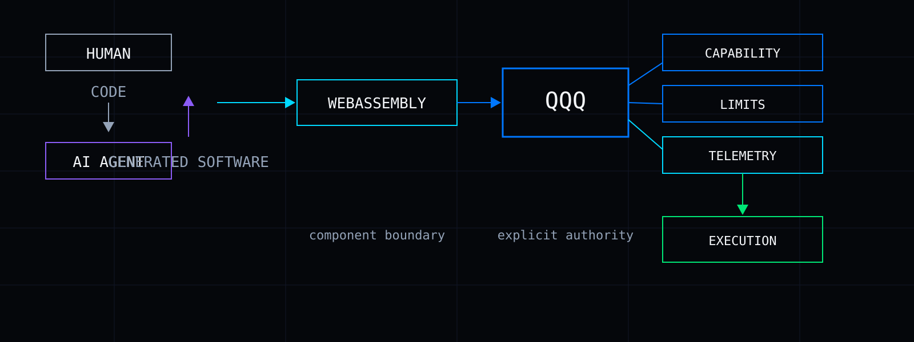
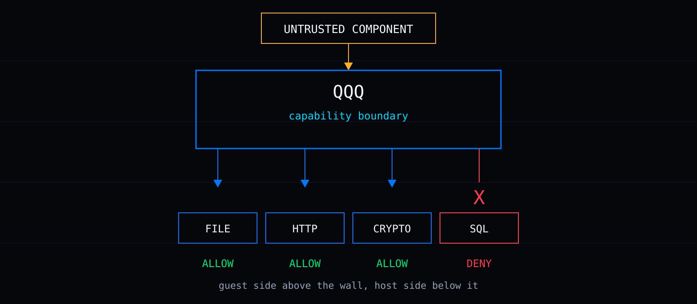
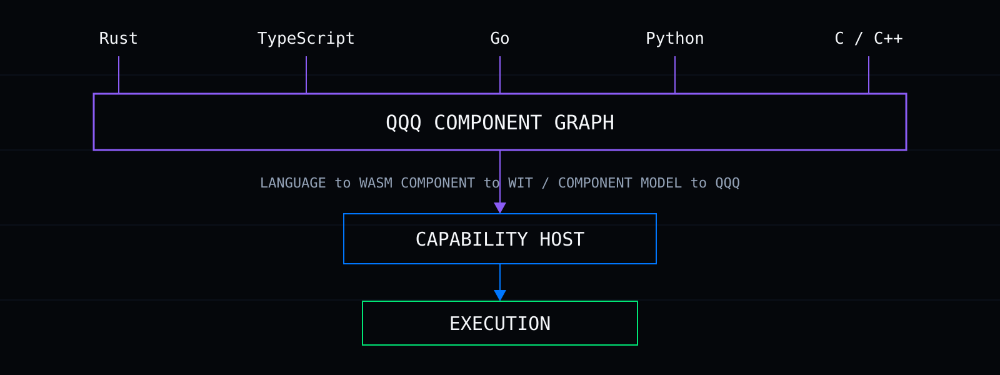
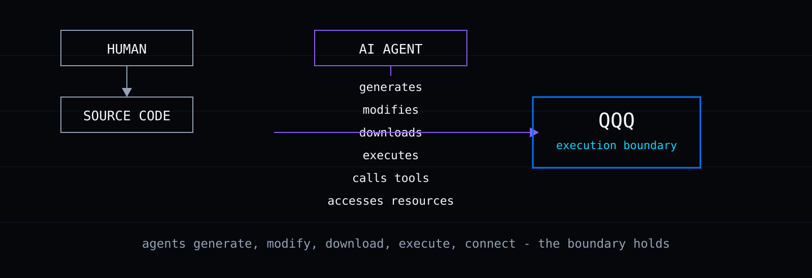
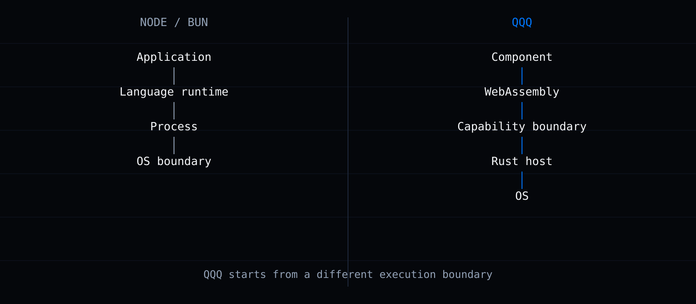
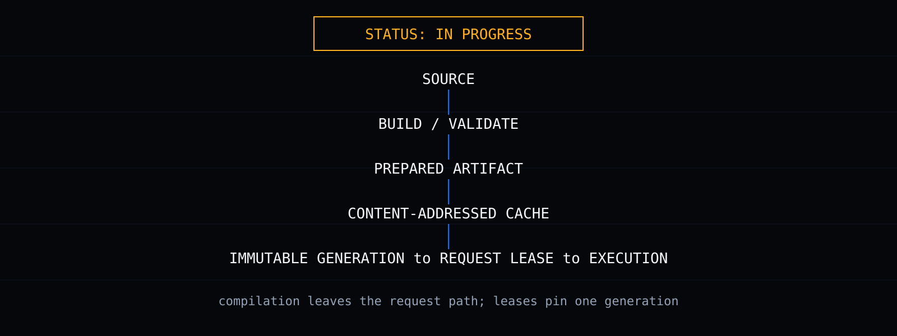
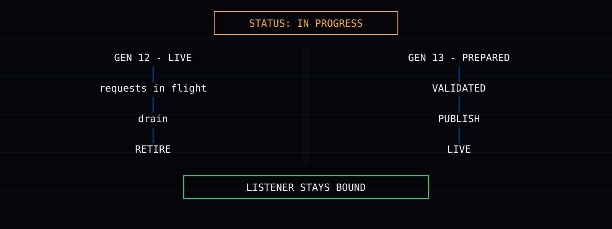

<p align="center">
  
</p>

<p align="center">
  
</p>

> The runtime built for humans and AI agents.

<p align="center">
  
  
  
  
  
</p>

<p align="center">
  <a href="#install">Install</a> ·
  <a href="#why-qqq">Why QQQ</a> ·
  <a href="#zero-authority-by-default">Security</a> ·
  <a href="#a-different-execution-model">Architecture</a> ·
  <a href="#one-runtime-multiple-languages-one-component-graph">Languages</a> ·
  <a href="#software-is-changing">AI Agents</a> ·
  <a href="#performance">Benchmarks</a> ·
  <a href="#status">Status</a> ·
  <a href="#documentation">Docs</a>
</p>

---

# RUN ANYTHING. TRUST NOTHING.

QQQ is a Rust-native WebAssembly runtime for software written by humans and machines. The execution unit is a component: small, isolated, and cheap to start. Every component runs with explicit capability boundaries, so untrusted code — including code written by AI agents — can run without being trusted.

---

## WHY QQQ

Today, software is increasingly generated by AI, assembled from dependencies, composed from multiple languages, executed automatically, connected to external systems, and difficult to trust before it runs.

The runtime boundary matters more when the software itself is generated dynamically.



---

## INSTALL

QQQ is pre-alpha. There are no published packages yet — no `cargo install`, no npm, no Homebrew. The way to try it is a source build:

```bash
git clone https://github.com/RatioArtificiosa/QQQ.git
cd QQQ
cargo build --release
```

Then run a command through Cargo (this is the form the project's own handbook uses):

```bash
cargo run -p qqq-run -- --help
```

You need the pinned Rust toolchain (the repository's `rust-toolchain.toml` selects it automatically) and a C linker for your platform. The full contributor gate — fmt, Clippy, tests, checkers — is documented in `CONTRIBUTING.md` in the main repository.

---

## ZERO AUTHORITY BY DEFAULT

QQQ is designed around explicit capability grants: a component receives only the authority the host makes available to it. Capabilities are explicit, the guest receives no ambient authority, authority is mediated by the host, policy is visible before execution where supported, limits are part of the execution contract, and security boundaries are testable.

The host builds each instance's linker from the resolved grant set. An import the manifest did not grant is absent, so instantiation fails before one guest instruction runs.



Real `qqq.toml`, using only fields the current parser accepts. This is the capability contract:

```toml
[package]
name    = "hello"
version = "0.1.0"

[capabilities.http]
server = true

[limits]
memory            = "128MiB"
fuel              = 50_000_000
epoch_deadline_ms = 5000
max_instances     = 200
max_open_handles  = 256
max_subrequests   = 32

[server]
routes = [{ path = "/", methods = ["GET"], handler = "index" }]
default_auth = "none"
```

The important part is not the syntax. It is that authority is explicit.

---

## ONE RUNTIME. MULTIPLE LANGUAGES. ONE COMPONENT GRAPH.

QQQ is designed for a multi-language component graph spanning Rust, TypeScript, Go, Python, and C/C++. The runtime boundary is the common substrate: each language compiles to a WebAssembly component, components join one typed graph, and the capability host executes it.



Honest per-language state, measured on Linux CI with five HTTP vectors (hello, UTF-8 output, 404, empty POST, 64 KiB binary echo):

| Language | Status | Evidence |
|---|---|---|
| Rust | Narrow probe passing | Scaffold, bindings, and conformance execution against a real guest |
| AssemblyScript | Experimental probe | 5/5 vectors; TypeScript-like subset, not full TypeScript |
| C / C++ | Experimental probe | 5/5 vectors via WASI SDK |
| TypeScript (engine path) | Experimental probe | 5/5 vectors via an engine-in-Wasm path |
| Go (TinyGo) | Experimental, bounded | Passes with `-gc=leaking`; the 64 KiB vector fails under precise GC (upstream lifetime issue, tracked) |
| Python | Experimental | 5/5 narrow vectors; startup cost and bindings still open |

Passing five vectors does not claim full bindings, drivers, templates, or conformance. Production language drivers remain open work.

---

## SOFTWARE IS CHANGING.

AI agents increasingly generate code, assemble dependencies, invoke tools, manipulate files, call services, and execute software. The execution boundary becomes part of the safety model.



## THE RUNTIME HAS TO CHANGE TOO.

QQQ treats machine-readable interfaces as a first-class developer-experience concern. What exists today:

- CLI with `--json` on every command
- Published JSON Schemas for machine surfaces
- MCP server over stdio (12 tools: build, run, test, inspect, audit, schemas, logs, metrics, and more)
- Stable `QQQ-XXXX` error codes with remediation text
- Static capability inspection (`qqqai inspect` reports what an artifact requires without running it)

---

## A DIFFERENT EXECUTION MODEL

Node and Bun optimize around language/runtime processes. QQQ is exploring a component-oriented execution model where the unit of composition is a WebAssembly component hosted by a Rust runtime.



QQQ starts from a different execution boundary. QQQ approaches reload and isolation at the component boundary rather than treating the process as the primary execution unit.

---

## PERFORMANCE

QQQ is being designed around predictable execution, efficient isolation, and tail-latency awareness. One measured result, with methodology, from [`docs/abi-cost-measured.md`](https://github.com/RatioArtificiosa/QQQ/blob/main/docs/abi-cost-measured.md):

- Crossing the component boundary costs a fixed ~900 ns per call at p50 (u64 round-trip, 20,000 samples, nearest-rank percentiles).
- Hardware: Intel Xeon E5-1650 v4, 64 GiB, Windows 10 Pro. Toolchain: rustc 1.98.1, Wasmtime 48.0.2, release profile. Commit `d3e71fd`.
- The same document publishes a second run, states what did not reproduce, and lists what it does not measure.

Published performance claims will only appear here after reproducible benchmarks exist. The benchmark methodology the project holds itself to — pinned hardware, warmup, percentiles, repetitions with variance, and a "what this does not measure" section — is defined in the technical proposal (§9.1).

---

## OPERATIONAL VISIBILITY

Status: DESIGNED.

The operations concept for QQQ is a terminal console: a live component graph, per-request cost metering, an authority view of what each component may touch, recorded executions available for replay, change simulation before applying edits, and an untrusted-code playground with near-zero grants. These are designed capabilities. They are not screenshots, and no dashboard shown here should be read as running output.

---

## DETERMINISTIC EXECUTION

Status: IN PROGRESS.

Deterministic execution and replay are core design goals. The implementation controls what it currently controls: seeded randomness, a fixed clock advanced by explicit host ticks, float canonicalization, and ordered maps in host interfaces. A hash-chained replay log records synchronous CLI executions for exact reproduction.

Not yet there: deterministic async scheduling, recorded network timing, and cross-version reproduction across engine upgrades. The full treatment is in the technical proposal (§10.5) and `docs/determinism.md` in the main repository.

---

## AOT

Status: IN PROGRESS.

Ahead-of-time compilation moves native compilation out of request dispatch. `qqqai build --aot` emits content-addressed native artifacts plus provenance, and the server reuses compatible native code across processes through an explicit operator-owned cache. The design keeps portable `.wasm` as the source of truth; the native artifact is a cache, never the authority.



The deep technical treatment is in the proposal and `docs/rfc/live-components-and-aot.md` in the main repository.

---

## HOT SWAP

Status: IN PROGRESS.

The registry holds versioned component generations. Each request leases the current generation at admission; publication is revision-checked so a stale build cannot overwrite a newer one; the old generation retires after its last lease finishes; a failed build leaves the last working generation serving. `qqqai dev` watches source, rebuilds, validates the candidate, and activates it while the listener stays bound.



---

## STATUS

Populated only from repository evidence. Nothing here is a roadmap promise.

| Area | Status |
|---|---|
| Core runtime | IN PROGRESS — pre-alpha workspace, 11 crates |
| WebAssembly execution | IMPLEMENTED — Wasmtime 48.0.5 pinned, real components served over HTTP |
| Capability model | IMPLEMENTED — manifest to grants to per-instance linker; 5 host modules bound (WASI baseline, clock, crypto, http, test assertions); sql, kv, fs, queue, env, ai, dns, trace, secrets declared, not yet bound |
| CLI | IN PROGRESS — new, build, run, dev, serve, test, inspect, audit, MCP and more |
| Language support | IN PROGRESS — Rust narrow probe passing; AssemblyScript, C/C++, TypeScript engine path, Go, Python experimental (see table above) |
| AOT | IN PROGRESS — managed cache and native emission; trust design open |
| Hot swap | IN PROGRESS — registry, leases, dev watcher live |
| Telemetry | IN PROGRESS — capability audit stream and tracing/metrics scaffolding; dashboard concept designed |
| MCP / agent interface | IMPLEMENTED — stdio server, 12 tools, structured errors |
| Package management | IN PROGRESS — lockfile with covering hash and capability diff; registry designed |
| Debugger | IN PROGRESS — DWARF-to-source mapping tables extracted from artifacts |

---

## DOCUMENTATION

| Document | Purpose |
|---|---|
| [Technical Proposal](https://github.com/RatioArtificiosa/QQQ/blob/main/QQQ-Proposal-V1.md) | Architecture and design |
| [Checklist](https://github.com/RatioArtificiosa/QQQ/blob/main/QQQ-Checklist-V1.md) | Implementation work breakdown |
| [Principles](https://github.com/RatioArtificiosa/QQQ/blob/main/PRINCIPLES.md) | Project invariants |
| [Security](https://github.com/RatioArtificiosa/QQQ/blob/main/SECURITY.md) | Vulnerability reporting and threat model |
| [Contributing](https://github.com/RatioArtificiosa/QQQ/blob/main/CONTRIBUTING.md) | Contribution workflow |

---

## CONTRIBUTING

See `CONTRIBUTING.md` in the main repository: find or create a checklist item, implement with tests, run the full gate after the last edit, and open a pull request that names the principles touched and shows what was measured.

## SECURITY

Do not open a public issue for a vulnerability. Use GitHub's private vulnerability reporting on the main repository, or email the maintainers. The full policy is in `SECURITY.md`.

---

<p align="center">
  <sub>
    Apache-2.0 · qqq.codes · Built on
    <a href="https://wasmtime.dev">Wasmtime</a>
    and the
    <a href="https://component-model.bytecodealliance.org">WebAssembly Component Model</a>
  </sub>
</p>

<p align="center">
  <strong>Run anything. Trust nothing.</strong>
</p>
